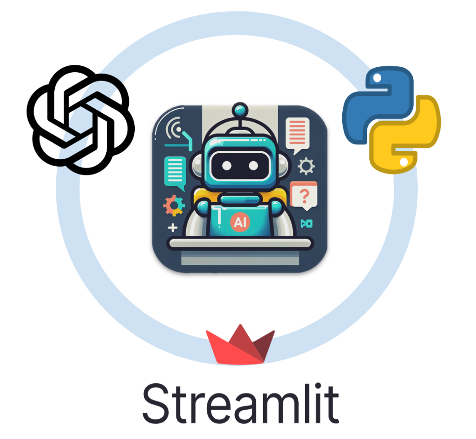

# RAKA: Customized AI Tutoring for Diverse Academic Courses

    

## Overview
**RAKA** is an educational web application that leverages the latest **OpenAI's Assistant API** and **Retrieval-Augmented Generation (RAG)** techniques to deliver customized tutoring across a wide range of academic subjects. It adapts dynamically to specific course content, providing a personalized and interactive learning experience.

## Core Features
- **Adaptive Learning**: Upload course-specific materials to tailor AI responses to particular subjects or topics.
- **Enhanced Accuracy**: Mitigates information hallucination by validating AI responses with reliable data sources.
- **User-Friendly Interface**: Streamlit-based UI for an intuitive and smooth user experience.
- **Data Privacy and Security**: Built with a focus on compliance with OpenAI's data protection policies.

## Technical Stack
- **Technologies**: Python, Streamlit, OpenAI's Assistants API, Retrieval-Augmented Generation (RAG).
- **Platform**: Hosted on **Streamlit Community Cloud** for free public access.
- **Data Handling**: Incorporates intelligent handling of uploaded course materials to enrich tutoring content.

## Methodology
AI-Tutor utilizes a combination of AI-driven technologies to deliver a robust educational experience:

- **LLM Integration**: OpenAI’s LLM enables the app to understand complex queries and generate responses that are both context-aware and informative.
- **RAG for Enhanced Learning**:
  - **Grounded Responses**: RAG supplements AI's built-in knowledge by retrieving relevant information from external sources, ensuring responses are accurate and contextually relevant.
  - **Reduced Information Hallucination**: By cross-checking AI-generated content with trusted data sources, AI-Tutor minimizes misinformation.
  - **Dynamic Tutoring**: Adapts to different courses, providing unique and tailored responses to diverse educational needs.

    

## Web App Components
- **Sidebar Options**:
  - Delete uploaded course materials.
  - Download Q&A transcripts in HTML format.
- **Main Interface**:
  - Input for OpenAI API Key.
  - Upload functionality for course materials.
  - Interactive Q&A section for engaging with the AI.
  - Real-time display and archive of question-answer history.

    

## Getting Started
1. **Launch the App**: Access [AI-Tutor on Streamlit](https://aitutor-gawywv3h6qfwzzvikfzkpl.streamlit.app/).
2. **API Configuration**: Input your OpenAI API Key in the designated field.
3. **Material Upload**: Upload relevant course documents to customize the tutoring experience.
4. **Engage with the AI**: Start asking questions and receive personalized answers.
5. **Transcript Download**: Save the Q&A session as an HTML file for future reference.

## Key Benefits
- **Personalized Learning**: AI-Tutor's tailored responses make learning more effective and engaging.
- **Accurate, Updated Information**: Leveraging RAG ensures current and precise content delivery.
- **Broad Application**: Suitable for various educational disciplines and subjects.
- **Data Security**: Committed to protecting user data in line with OpenAI’s security standards.
- **Seamless Interaction**: Provides an interactive platform for real-time question-and-answer sessions.

## Future Enhancements
- **Advanced Analytics**: Integrating learning analytics to track user progress.
- **Multilingual Support**: Expanding AI capabilities to support different languages.
- **Mobile Optimization**: Optimizing the app for mobile devices.

## References
- [OpenAI Assistant API Documentation](https://platform.openai.com/docs/guides/assistants)
- [Introduction to Retrieval-Augmented Generation (RAG)](https://www.datastax.com/blog/2020/10/introducing-retrieval-augmented-generation-rag)
- [Vector Database Similarity Search](https://www.infoworld.com/article/3634357/what-is-vector-search-better-search-through-ai.html)
- [OpenAI Privacy and Security Practices](https://openai.com/security)

---

Feel free to reach out with any feedback or feature suggestions for further enhancements.
